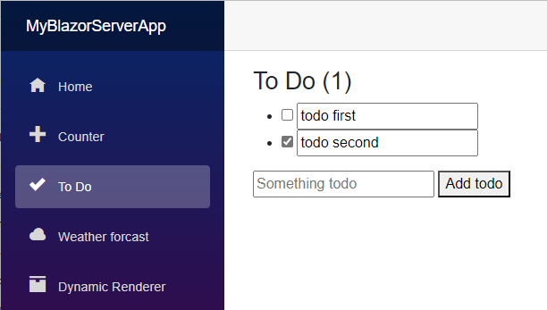
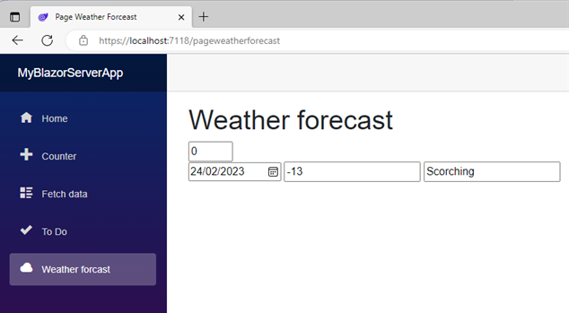
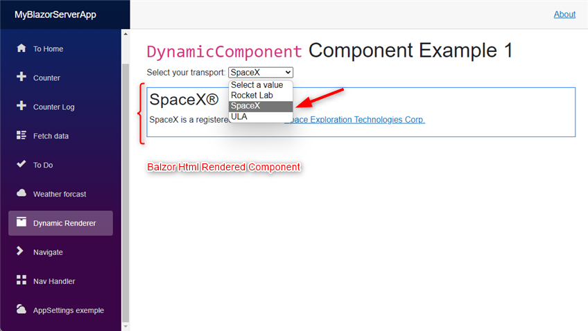
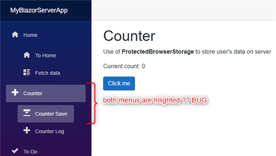
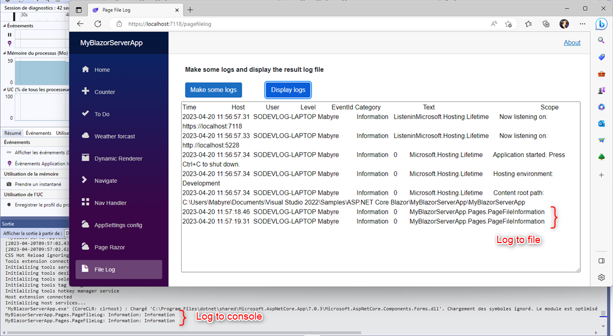


# My Blazor Server App

My Sample Balzor App to demonstate cherry picked code, that I want to look at, make it mine.

## Summary

- [Separate Code and View](#Separate-Code-and-View)
- [Use of interface in Data Services](#Use-of-interface-in-Data-Services)
- [Add a TodoList](#Add-a-TodoList)
- [Add Page WeatherForcaste](#Add-Page-WeatherForcaste)
- [Creation of Class Razor Librairie](#Creation-of-Class-Razor-Librairie)
- [Blazor Dynamic Component](#Blazor-Dynamic-Component)
- [NavHandler use of OnAfterRender](#NavHandler-use-of-OnAfterRender)
- [Use of appsettings.json](#Use-of-appsettingsjson)
- [Counter now demonstrate the use of ILogger in code behing](#Counter-now-demonstrate-the-use-of-ILogger-in-code-behing)
- [Create NavLink as SubMenu](#Create-NavLink-as-SubMenu)
- [Use of submodule FileLogger.Logging](#Use-of-submodule-FileLoggerLogging)

## Separate Code and View

* Look in Pages/Counter code is seperate by derivate from ComponentBase and the use of @inherits CounterBase in razor page.

At the begining, after using this, I gave up cause of numerous waste of time due to variables private not protected forgotten. I know use the template wich is a partial class less time wasted.

If we needed secure component may be most use this way of code-behind with **@inherits CounterBase** and rename the ***private*** variables to ***protected***.

Ask [Christophe Mommer](https://hts-learning.com/shop/course/infos/blazor-server)

See [Accessibility Levels](https://learn.microsoft.com/en-us/dotnet/csharp/language-reference/keywords/accessibility-levels)

## Use of interface in Data Services

* To separate Code from Fetch Data View

Can be useful if another Razor page would like to display Weather data

## Add a TodoList

Sample ToDoList in Balzor :



Yes I find it very cool and efficent
 
## Add Page WeatherForcaste

* To use EditForm capabilities of Blazor binding a form on a Model



## Creation of Class Razor Librairie

First I had to find how to use "git move" to move this project to a subdirectory then to add the class blazor librairy. 

**To Be Done.**

## Blazor Dynamic Component

Dynamicly change the html content using **DynamicComponent** to load html Blazor components



I say "Html component" because there is no much more in those Blazor Component sample shoud be enhanced.

## Use of appsettings.json

So easy to use \MyBlazorServerApp\wwwroot\appsettings.json

See Page :

[ConfigurationExample.razor](https://github.com/mabyre/MyBlazorServerApp/blob/master/Pages/ConfigurationExample.razor)

```json
{
  "h1FontSize": "50px"
}
```

```html
<h1 style="font-size:@Configuration["h1FontSize"]">
    Configuration example
</h1>
```

## NavHandler use of OnAfterRender

To allow or prevent navigation

## Counter now demonstrate the use of ILogger in code behing

The use of **ILoggerFactory** and **ILogger** in **code-behind**.

```csharp
    [Inject]
    protected ILoggerFactory loggerFactory { get; set; }

    private ILogger<CounterBase> logger => loggerFactory.CreateLogger<CounterBase>();
```

## Counter Save use of ProtectedBrowserStorage

Sate Management in Blazor Web App

## Create NavLink as SubMenu

### Reference

- [ASP.NET Core Blazor routing and navigation](https://learn.microsoft.com/en-us/aspnet/core/blazor/fundamentals/routing?view=aspnetcore-7.0#navlink-and-navmenu-components)

This is useful when the application grows and the menus are multiplying.

```razor
    <div class="nav-item px-3">
        <NavLink class="nav-link" href="" Match="NavLinkMatch.All">
        <NavLink class="nav-link" href="" Match="NavLinkMatch.All" @onclick="()=>expandSubMenuHome = !expandSubMenuHome">
            <span class="oi oi-home" aria-hidden="true"></span> Home
        </NavLink>
    </div>
    <div class="nav-item px-3">
    @if (expandSubMenuHome)
    {
        <div class="nav-item px-5">
            <NavLink class="nav-link" href="index">
                <span class="oi oi-home" aria-hidden="true"></span> To Home
            </NavLink>
            <NavLink class="nav-link" href="fetchdata">
                <span class="oi oi-list-rich" aria-hidden="true"></span> Fetch data
            </NavLink>
        </div>
    }

@code {

    // --- Expand Navlink SubMenu

    private bool expandSubMenuHome = false;
}
```

[Commit](https://github.com/mabyre/MyBlazorServerApp/commit/a17cbb1bb01d461b2d8ba12008241ae932eedbb6)

I had a Bug !



To avoid i should do this :

[Commit](https://github.com/mabyre/MyBlazorServerApp/commit/c62f9874afdb84492a011e73e9f398afd3a6ac7c)

I suppose that it's because counter is the name of the main menu so counter-save will not be trate **To Be Confirmed**

## Use of submodule FileLogger.Logging
Now use the submodule FileLogger to make logs in file. Adding a page PageFileLog to make logs and display the log file content.



It's a very cool stuff because now you can have a look to what's happening into you Blazor Server Application.

---

[:arrow_up_small: Top of page](https://github.com/mabyre/MyBlazorServerApp#my-blazor-server-app)


